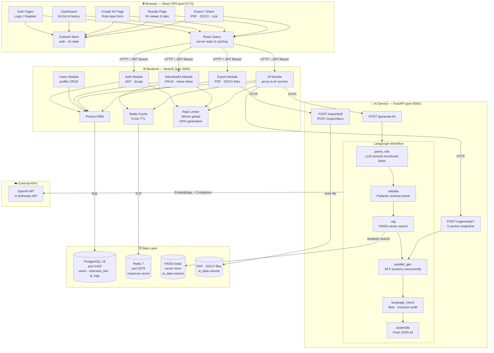
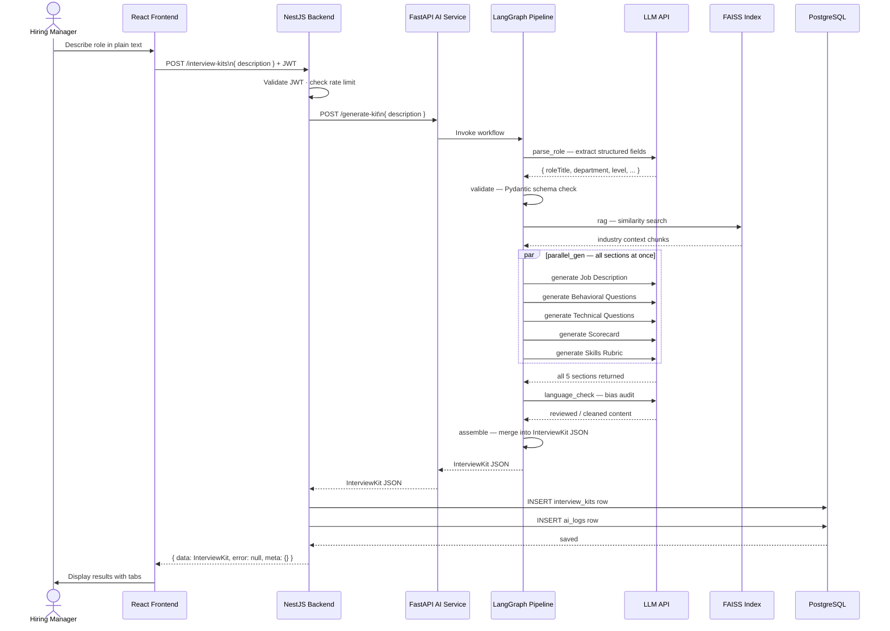
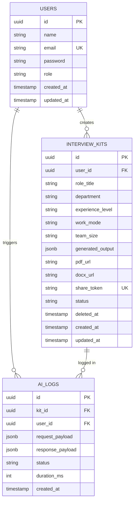
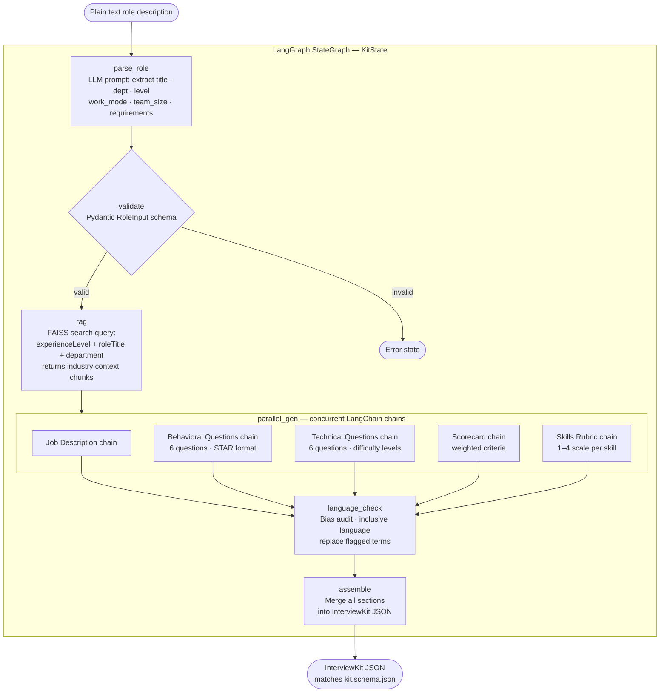
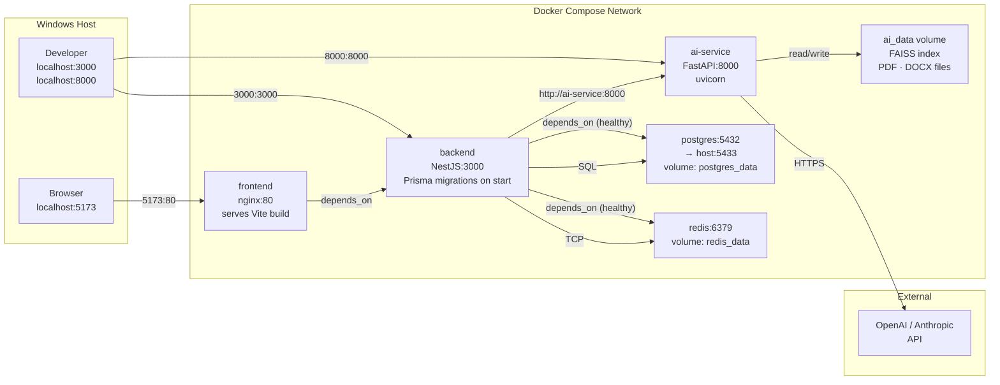
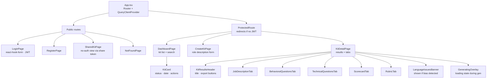

# GenAI Interview Kit — Architecture Diagrams

---

## 1. System Overview

---

## 2. Request Flow — Kit Generation

---

## 3. Database Entity Relationship

---

## 4. LangGraph AI Pipeline (detailed)

---

## 5. Docker Compose Infrastructure

---

## 6. Frontend Component Tree

---

> **Tip:** These diagrams render in GitHub, VS Code (Markdown Preview), Obsidian,
> Notion, and any editor with a Mermaid plugin. You can also paste any diagram
> block into [mermaid.live](https://mermaid.live) to view and export it as SVG or PNG.
